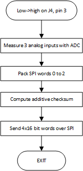
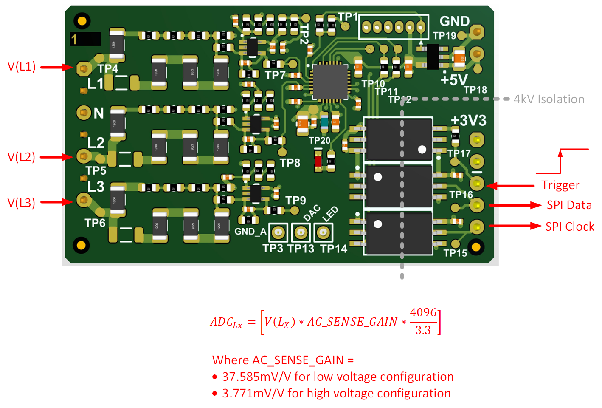

---

# dsPIC33C Isolated Voltage Acquisition Board

### dsPIC33CK Firmware for Isolated Voltage Acquisition Board

<a target="_blank" href="https://www.microchip.com/en-us/tools-resources/reference-designs/11-kw-totem-pole-demonstration-application" rel="nofollow">
Isolated Voltage Acquisition Board.
</a>

---

## Summary

The Isolated Voltage Acquisition Board can be used for isolated sensing of up to three
voltages. Three op amps, a small dsPIC33C and three opto-couplers are used to scale,
digitize and transmit the sensed voltages across the isolation barrier.

The board was originally developed as a Plug-In Board (PIM) for our dsPIC33C 11kW Totem Pole Demonstration Application. In this case, it is used to sense the three-phase AC line voltages with reference to neutral, and send this information to the main PFC controller, which
sits on the output voltage ground. It is preprogrammed for this function but can be easily adapted for other functions by changing the firmware on the dsPIC33C.

In this document we describe the pre-programmed firmware.

[[back to top](#start-doc)]
- - -

## Highlights

- 4kV galvanic isolation
- Accurate sensing of AC voltages up to 27V rms (low voltage configuration) and 265V rms (high voltage configuration)
- dsPIC33C configurable via firmware leads to flexibility for a wide variety of applications

[[back to top](#start-doc)]

- - -

## Related Documentation

__Hardware Documentation__

- [T11 kW Totem-Pole Demonstration Application Landing Page](https://www.microchip.com/en-us/tools-resources/reference-designs/11-kw-totem-pole-demonstration-application)

__Target Device Documentation__

- [dsPIC33CK32MC102 landing page](https://www.microchip.com/en-us/product/dsPIC33CK32MC102)

__Please always check for the latest data sheets on the respective product websites:__

- - -

## Software Used

- [MPLAB&reg; X IDE v6.10](https://www.microchip.com/mplabx-ide-windows-installer)
- [MPLAB&reg; XC16 Compiler v2.10](https://www.microchip.com/mplabxc16windows)
- [Microchip Code Configurator v5.1.17](https://www.microchip.com/mplab/mplab-code-configurator)

## Hardware Used

- [11kW Totem Pole Demonstration Application](https://www.microchip.com/en-us/tools-resources/reference-designs/11-kw-totem-pole-demonstration-application)

[[back to top](#start-doc)]

- - -

## Functionality Overview

The operation of the firmware is quite straightforward.

See below. 

 
Isolated Voltage Acquisition Firmware Operation

On a low to high transition on pin 3 of J4, an interrupt is triggered.
In the interrupt, the 3 input voltages (relative to N) are measured with the 12-bit ADC on the dsPIC33CK. A checksum is computed, and the data is sent across the isolaton barrier via SPI using 2 optocouplers. 

 
Inputs and Outputs of Isolated Voltage Acquisition Board

[[back to top](#start-doc)]

- - -

&copy; 2023, Microchip Technology Inc.
