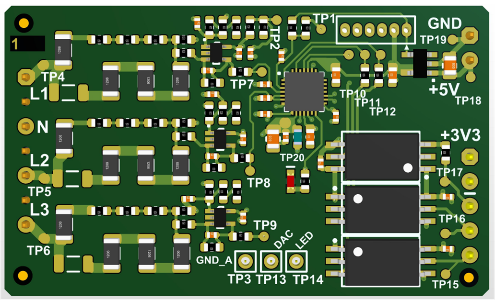

---

# dsPIC33C Isolated Voltage Acquisition Board

### dsPIC33CK Firmware for Totempole PFC Development Platform

<a target="_blank" href="https://www.microchip.com/en-us/development-tool/EV84C64A" rel="nofollow">
dsPIC33 Interleaved LLC Converter Power Board.
</a>

---

## Summary

The Isolated Voltage Acquisition Board can be used for isolated sensing of up to three
voltages. Three op amps, a small dsPIC33C and three opto-couplers are used to scale,
digitize and transmit the sensed voltages across the isolation barrier.

The board was originally developed as a Plug-In Board (PIM) for our dsPIC33C Totem Pole PFC Development Platform. In this application it is used to sense the three-phase AC line voltages
with reference to neutral, and send this information to the main PFC controller, which
sits on the output voltage ground. It is preprogrammed for this function but can be easily adapted for other functions by changing the firmware on the dsPIC33C.

In this document we describe the pre-programmed firmware.

[[back to top](#start-doc)]
- - -

## Highlights

- 4kV galvanic isolation
- Accurate sensing of AC voltages up to 27V rms (low voltage configuration) and 265V rms (high voltage configuration)
- dsPIC33C configurable via firmware leads to flexibility for a wide variety of applications

[[back to top](#start-doc)]

- - -

## Related Documentation

__Firmware documentation__

- [Online Firmware Documentation of this Code Example](https://microchip-pic-avr-examples.github.io/llc50w-power-voltage-mode-control-with-active-current-sharing)

__Hardware Documentation__

- [Interleaved LLC Development Board Product Webpage](https://www.microchip.com/en-us/development-tool/EV84C64A)

__Target Device Documentation__

- [dsPIC33CK256MP508 Family Data Sheet](https://www.microchip.com/70005349)
- [dsPIC33CK256MP508 Family Silicon Errata and Data Sheet Clarification](https://www.microchip.com/80000796)

__Please always check for the latest data sheets on the respective product websites:__

- [dsPIC33CK256MP508 Family](https://www.microchip.com/dsPIC33CK256MP508)
- [dsPIC33CH512MP508 Family](https://www.microchip.com/dsPIC33CH512MP508)

- - -

## Software Used

- [Power Board Visualizer GUI](https://www.microchip.com/en-us/software-library/power_board_visualizer)
- [MPLAB&reg; X IDE v5.50](https://www.microchip.com/mplabx-ide-windows-installer)
- [MPLAB&reg; XC16 Compiler v1.70](https://www.microchip.com/mplabxc16windows)
- [Microchip Code Configurator v5.0.3](https://www.microchip.com/mplab/mplab-code-configurator)
- [Digital Compensator Design Tool](https://www.microchip.com/developmenttools/ProductDetails/DCDT)
- [MPLAB&reg; Mindi™ Simulator](https://www.microchip.com/en-us/development-tools-tools-and-software/embedded-software-center/mplab-mindi-analog-simulator)

## Hardware Used

- Interleaved LLC Development Board, Part-No. [EV84C64A](https://www.microchip.com/en-us/development-tool/EV84C64A)
- dsPIC33CK256MP506 Digital Power PIM, Part-No. [MA330048](https://www.microchip.com/MA330048)

[[back to top](#start-doc)]

- - -

[[back to top](#start-doc)]

- - -

&copy; 2021, Microchip Technology Inc.
